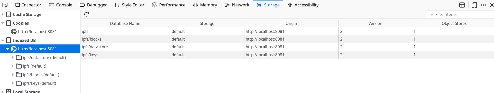
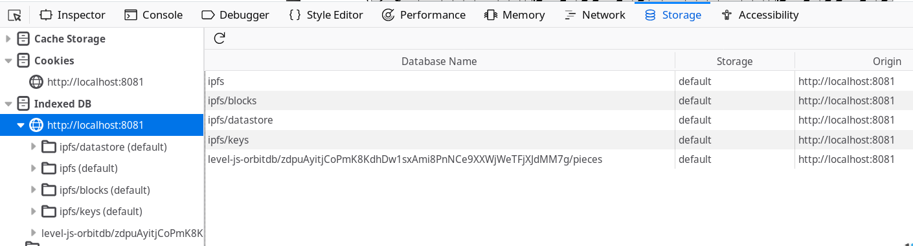

<!--
author:   Your Name

email:    your@mail.org

version:  0.0.1

language: en

narrator: US English Female

comment:  Try to write a short comment about
          your course, multiline is also okay.

script:   https://unpkg.com/ipfs@0.35.0/dist/index.min.js
          https://www.unpkg.com/orbit-db/dist/orbitdb.min.js


@onload
window.reportError = function(error) {
  let line = getLineNumber(error);
  let details = [];
  let msg = "An error occured";

  if (line) {
    details = [[{ row : line-1,
               column : 0,
                 text : error.message,
                 type : "error" }]];

    msg += " on line " + line;
  }
  return [ msg + "\n" + error.message, details ];
};
@end

@eval
<script>
async function eee(code) {
  let oldLog = window.console.log;

  window.console.log = console.log;

  try {
    const evalString = '(async function runner() { try { ' + code + '} catch (e) { reportError(e) } })()';

    await eval(evalString).catch(function(e) {
      window.console.log = oldLog;
      let [msg, details] = reportError(e);
      send.lia(msg, details, false);
      send.lia("LIA: stop");
    });
  }
  catch(e) {
    window.console.log = oldLog;
    let [msg, details] = reportError(e);
    send.lia(msg, details, false);
    send.lia("LIA: stop");
  }
  send.lia("LIA: stop");

};
setTimeout(function(e){ eee(`@input`+"\n") }, 10);
"LIA: wait";
</script>
@end

-->

# __1 - Laying the Foundation__

> The basics of OrbitDB include installing OrbitDB (and IPFS), setting up an
> isomorphic project that runs in both Node.js and the browser, creating
> databases, and understanding how to choose datastores.


<h3>Table of Contents</h3>

Please see the [Introduction](./00_Introduction.md) before beginning this chapter.

- [Installing the requirements: IPFS and OrbitDB](#installing-the-requirements-ipfs-and-orbitdb)
- [Instantiating IPFS and OrbitDB](#instantiating-ipfs-and-orbitdb)
- [Creating a database](#creating-a-database)
- [Choosing a datastore](#choosing-a-data-store)
- [Key takeaways](#key-takeaways)


## Installing the requirements: IPFS and OrbitDB

Before you start working on the core functionality behind the peer-to-peer
sharing of sheet music, you’ll need to get the foundations of our distributed
database set up.

You will need to get the code for OrbitDB and its dependency, IPFS, and make it
available to your project. The process is different between the browser and
Node.js, so we cover both here.

> **Note**: Both OrbitDB and js-ipfs are open source, which give you the ability
> to build and even contribute to the code. This will be covered in detail in
> [Part 3](../03_The_Architecture_of_OrbitDB).

### In Node.js

Choose a project directory and `cd` to there from your command line. Then run
the following command:

```bash
$ npm init --yes
$ npm install --save orbit-db ipfs
```

This will create a `package.json`, `package-lock.json`, and `node_modules`
folder.

> **Note:** If you're running on a Windows prompt, or if you don't have certain
> build tools like [`g++`](https://gcc.gnu.org) and
> [`python`](https://www.python.org) installed, you may see a noisy console
> output with lots of warnings and errors. Keep going, your code should still
> run.

> **Note:** Adding the `--yes` flag will automatically use your npm defaults.
> You can go through and edit the package.json later, but it's not entirely
> necessary for this part of the tutorial.

If you want to use Git to track your progress, we also suggest the following:

```bash
$ git init
$ echo node_modules > .gitignore
```

Of course, be careful before copying and pasting any commands anyone ever tells
you into your terminal. If you don't understand a command, figure out what it is
supposed to do, before copying it over. Copy and paste at your own risk.

> **Note:** This code was tested on Node v11.14.0. Your mileage for other
> versions may vary.

### In the Browser

If you're using the browser for this tutorial, we recommend using
[unpkg](https://www.unpkg.com) for obtaining pre-built, minified versions of
both IPFS and OrbitDB. Simply include these in your HTML:

```html
<script src="https://unpkg.com/ipfs@0.35.0/dist/index.min.js"></script>
<script src="https://www.unpkg.com/orbit-db/dist/orbitdb.min.js"></script>
```

You will now have global `Ipfs` and `OrbitDB` objects available to you. You will
see how we'll use these later.

## Creating the isomorphic bookends

Since OrbitDB works in the browser and Node.js, you're going to want to make the
library as _isomorphic_ as possible. This means we want the same code to run in
the browser as runs in REPL or local environment. Luckily, you will have the
luxury of using the same language, JavaScript, for both Node.js and browser
environments.

Create a new file called `newpieceplease.js` and put this code in there:

```js
class NewPiecePlease {
  constructor (Ipfs, OrbitDB) {
    this.Ipfs = Ipfs;
    this.OrbitDB = OrbitDB;
  }
}

try {
  const Ipfs = require('ipfs');
  const OrbitDB = require('orbit-db');

  module.exports = exports = new NewPiecePlease(Ipfs, OrbitDB);
} catch (e) {
  window.NPP = new NewPiecePlease(window.Ipfs, window.OrbitDB);
}
```
<script>@input</script>

Source:
[GitHub](https://github.com/orbitdb/field-manual/blob/a5459ac56402f620cab424c6c399f7c593e94f85/code_examples/01_01_newpieceplease.js),
or on IPFS at `QmRZycUKy3MnRKRxkLu8jTzBEVHZovsYcbhdiwLQ221eBP`.

In the browser, you can include this file in a script tag and have an `NPP`
object at your disposal. In Node.js, you can simply call something like:

```plain
$ node

> const NPP = require('./newpieceplease')
```

Not much should happen either way, since there's not much code there yet. For
now just make sure you can create the `NPP` constant.

### What just happened?

Using some key JavaScript features, you have created the shell for our
application that runs in both Node.js and the browser. It defines a new class
called `NewPiecePlease`, with a constructor that takes two arguments

1. `IPFS` for the `js-ipfs` constructor
2. `OrbitDB` for the `orbit-db` constructor

From here on out, we will ignore these isometric bookends and concentrate wholly
on the `NewPiecePlease` class.

## Instantiating IPFS and OrbitDB

OrbitDB requires a running IPFS node to operate, so you will create one here and
notify OrbitDB about it.

> **Note:** We have designed Chapters 1 and 2 of the tutorial to work offline,
> not requiring any internet connectivity or connections to peers.

```js
class NewPiecePlease {
  constructor (Ipfs, OrbitDB) {
    this.OrbitDB = OrbitDB

    this.node = new Ipfs({
      preload: { enabled: false },
      repo: './ipfs',
      EXPERIMENTAL: { pubsub: true },
      config: {
        Bootstrap: [],
        Addresses: { Swarm: [] }
      }
    })

    this.node.on('error', (e) => { throw (e) })
    this.node.on('ready', this._init.bind(this))
  }

  onready () {
    console.log()
    console.log("onready with id => ", NPP.orbitdb.id)
  }

  async _init () {
    this.orbitdb = await this.OrbitDB.createInstance(this.node)
    this.onready()
  }
}

try {
  const Ipfs = require('ipfs');
  const OrbitDB = require('orbit-db');

  module.exports = exports = new NewPiecePlease(Ipfs, OrbitDB);
} catch (e) {
  window.NPP = new NewPiecePlease(window.Ipfs, window.OrbitDB);
}
```
<script>@input</script>

Source:
[GitHub](https://github.com/orbitdb/field-manual/blob/68714a5eef18530ef172bb0f889a90d5f91ef39a/code_examples/newpieceplease.js),
or on IPFS at `QmZsbrY7EZJRXwuqQXw2Ad9jfJAMvLWDcrwLNj7Yo4v7YK`.

This allows you to run something like the following in your application code:

```JavaScript
/*
NPP.onready = () => {
   console.log(NPP.orbitdb.id)
}

or ...
*/

NPP.orbitdb.id
```
<script>@input</script>

In the output you will see something called a "multihash", like
`QmPSicLtjhsVifwJftnxncFs4EwYTBEjKUzWweh1nAA87B`. This is the identifier of your
IPFS node. (You may have noticed we referenced multihashes above for the code
examples: these are the multihashes you can use to download the example code
files, if GitHub is down.)

#### What just happened?

Start with the `new Ipfs` line. This code creates a new IPFS node. Note the
default settings:

- `preload: { enabled: false }` disables the use of so-called "pre-load" IPFS
  nodes. These nodes exist to help load balance the global network and prevent
  DDoS. However, these nodes can go down and cause errors. Since we are only
  working offline for now, we include this line to disable them.

- `repo: './ipfs'` designates the path of the repo in Node.js only. In the
  browser, you can actually remove this line. The default setting is a folder
  called `.jsipfs` in your home directory. You will see why we choose this
  specific location for the folder later.

- `EXPERIMENTAL: { pubsub: true }` enables
  [IPFS pubsub](https://blog.ipfs.io/25-pubsub/), which is a method of
  communicating between nodes and **is required for OrbitDB usage**, despite
  whether or not we are connected to other peers.

- `config: { Bootstrap: [], Addresses: { Swarm: [] }}` sets both our bootstrap
  peers list (peers that are loaded on instantiation) and swarm peers list
  (peers that can connect and disconnect at any time to empty. We will populate
  these later.

- `node.on("error", (e) => { throw new Error(e) })` implements extremely basic
  error handling if something happens during the creation of the IPFS node.

- `node.on("ready", (e) => { orbitdb = new OrbitDB(node) })` instantiates
  OrbitDB on top of the IPFS node when it is ready.

By running the code above, you have created a new IPFS node that works locally
and is not connected to any peers. You have also loaded a new `orbitdb` object
into memory, ready to create databases and manage data.

*You are now ready to use OrbitDB!*

#### What else happened in Node.js?

When you ran the code in Node.js, you created two folders in your project
structure: `'orbitdb/` and `ipfs/`.

```bash
$ # slashes added to ls output for effect
$ ls orbitdb/
QmNrPunxswb2Chmv295GeCvK9FDusWaTr1ZrYhvWV9AtGM/

$ ls ipfs/
blocks/  config  datastore/  datastore_spec  keys/  version
```

Looking inside the `orbitdb/` folder you will see that the subfolder has the
same ID as orbitdb, as well as the IPFS node. This is purposeful, as this
initial folder contains metadata that OrbitDB needs to operate. See Part 3 for
detailed information about this.

The `ipfs/` folder contains all of your IPFS data. Explaining this in depth is
outside of the scope of this tutorial, but  the curious can find out more
[here](https://ipfs.io).

#### What else happened in the browser?

In the browser IPFS content is handled inside of IndexedDB, a persistent storage
mechanism for browsers

<!--style="width:100%"-->

Note since you have not explicitly defined a database in the browser, no
IndexedDB databases have been created for OrbitDB yet.

> **Caution!** iOS and Android have been known to purge IndexedDB if storage
> space needs to be created inside of your phone. We recommend creating robust
> backup mechanisms at the application layer

### Creating a database

Your users will want to create a catalog of musical pieces to practice. You will
now create this database, and ensure that *only that user* can write to it.

Expand of your `_init` function to the following:

```diff
  async _init () {
    this.orbitdb = await OrbitDB.createInstance(node)
+   this.defaultOptions = { accessController: { write: [this.orbitdb.identity.id] }}
+
+   const docStoreOptions = {
+     ...this.defaultOptions,
+     indexBy: 'hash',
+   }
+   this.pieces = await this.orbitdb.docstore('pieces', docStoreOptions)
+   this.onready()
  }
```

The entire program looks like this:

```js               -index.js
class NewPiecePlease {
  constructor (Ipfs, OrbitDB) {
    this.OrbitDB = OrbitDB

    this.node = new Ipfs({
      preload: { enabled: false },
      repo: './ipfs',
      EXPERIMENTAL: { pubsub: true },
      config: {
        Bootstrap: [],
        Addresses: { Swarm: [] }
      }
    })

    this.node.on('error', (e) => { throw (e) })
    this.node.on('ready', this._init.bind(this))
  }

  onready () {
    console.log()
    console.log("onready with id => ", NPP.orbitdb.id)
  }

  async _init () {
    this.orbitdb = await this.OrbitDB.createInstance(this.node)
    this.defaultOptions = { accessController: { write: [this.orbitdb.identity.id] }}

    const docStoreOptions = {
      ...this.defaultOptions,
      indexBy: 'hash',
    }
    this.pieces = await this.orbitdb.docstore('pieces', docStoreOptions)
    this.onready()
  }
}

try {
  const Ipfs = require('ipfs');
  const OrbitDB = require('orbit-db');

  module.exports = exports = new NewPiecePlease(Ipfs, OrbitDB);
} catch (e) {
  window.NPP = new NewPiecePlease(window.Ipfs, window.OrbitDB);
}
```
@eval


Then, in your application code, run this:

```JavaScript
/*
NPP.onready = () => {
   console.log(NPP.pieces.id)
}

or ...
*/

NPP.pieces.id
```
<script>@input</script>

You will see something like the following as an output:
`/orbitdb/zdpuB3VvBJHqYCocN4utQrpBseHou88mq2DLh7bUkWviBQSE3/pieces`. This is the
id, or **address** (technically a multiaddress) of this database. It is
important for you to not only _know_ this, but also to understand what it is.
This string is composed of 3 parts, separated by `/`s:

1. The first bit, `/orbitdb.`, is the protocol. It tells you that this address
   is an OrbitDB address.
2. The second, or middle, part
   `zdpuB3VvBJHqYCocN4utQrpBseHou88mq2DLh7bUkWviBQSE3` that is the most
   interesting. This is the Content ID (CID) of the database manifest, which
   contains:

   - The **access control list** of the database
   - The **type** of the database
   - The **name** of the database

3. The final part is the name you provided, in this case `pieces`, which becomes
   the final part of the multiaddress

> *Note:* Addresses that start with Qm… are typically CIDv0 content addresses,
> while addresses that start with zdpu…. are CIDv1. Misunderstanding OrbitDB
> addresses can lead to some very unexpected - sometimes hilarious, sometimes
> disastrous outcomes.

#### What just happened?

Your code created a local OrbitDB database, of type "docstore", writable only by
the user who created it.

* `defaultOptions` and `docStoreOptions` define the parameters for the database
  we are about to create.

  - `accessController: { write: [orbitdb.identity.id] }` defines the ACL, or
    "Access Control List". In this instance we are restricting `write` access to
    ONLY the OrbitDB instances identified by our particular `id`
  - `indexBy: "hash"` is a docstore-specific option, which specifies which field
    to index our database by

* `pieces = await orbitdb.docstore('pieces', options)` is the magic line that
   creates the database. Once this line is completed, the database is open and
   can be acted upon.

> **Caution!** A note about identity: Your public key is not your identity. We
> repeat, *your public key is not your identity*.  That being said, it is often
> used as such for convenience's sake, and the lack of better alternatives. So,
> in the early parts of this  tutorial we say "writable only to you" when we
> really mean "writable only by an OrbitDB instance on top of an IPFS node that
> has the correct id, which we are assuming is controlled by you."

##### What else happened in Node.js?

You will see some activity inside your project's `orbitdb/` folder. This is good.

```bash
$ ls orbitdb/
QmNrPunxswb2Chmv295GeCvK9FDusWaTr1ZrYhvWV9AtGM/  zdpuB3VvBJHqYCocN4utQrpBseHou88mq2DLh7bUkWviBQSE3/

$ ls orbitdb/zdpuB3VvBJHqYCocN4utQrpBseHou88mq2DLh7bUkWviBQSE3/
pieces/

$ ls orbitdb/zdpuB3VvBJHqYCocN4utQrpBseHou88mq2DLh7bUkWviBQSE3/pieces/
000003.log  CURRENT  LOCK  LOG  MANIFEST-000002
```

You do not need to understand this fully for now, just know that it happened.
Two subfolders, one being the original folder you saw when you instantiated
OrbitDB, and now another that has the same address as your database.

##### What else happened in the browser?

Similarly, a new IndexedDB database was created to hold your OrbitDB-specific
info, apart from the data itself which are still stored in IPFS.

<!--style="width: 100%"-->

This shows you one of OrbitDB's core strengths - the ability to manage a lot of
complexity between its own internals and those of IPFS, providing a clear and
clean API to manage the data that matters to you.

### Choosing a datastore

OrbitDB organizes its functionality by separating different data management
concerns, schemas and APIs into **stores**. We chose a `docstore` for you in the
last chapter, but after this tutorial it will be your job to determine the right
store for the job.

Each OrbitDB store has its own specific API methods to create, delete, retrieve
and update data. In general, you can expect to always have something like a
`get` and something like a `put`.

You have the following choices:

| Name                                                                                              | Description                                                                                                                                                                     |
| ------------------------------------------------------------------------------------------------- | ------------------------------------------------------------------------------------------------------------------------------------------------------------------------------- |
| **[log](https://github.com/orbitdb/orbit-db/blob/master/API.md#orbitdblognameaddress)**           | An _immutable_ (append-only) log with traversable history. Useful for *"latest N"* use cases or as a message queue.                                                             |
| **[feed](https://github.com/orbitdb/orbit-db/blob/master/API.md#orbitdbfeednameaddress)**         | A _mutable_ log with traversable history. Entries can be added and removed. Useful for *"shopping cart"* type of use cases, or for example as a feed of blog posts or "tweets". |
| **[keyvalue](https://github.com/orbitdb/orbit-db/blob/master/API.md#orbitdbkeyvaluenameaddress)** | A simple key-value database that supports any JSON-serializable data, even nested objects.                                                                                      |
| **[docs](https://github.com/orbitdb/orbit-db/blob/master/API.md#orbitdbdocsnameaddress-options)** | A document database that stores JSON documents which can be indexed by a specified key. Useful for building search indices or version controlling documents and data.           |
| **[counter](https://github.com/orbitdb/orbit-db/blob/master/API.md#orbitdbcounternameaddress)**   | An increment-only integer counter useful for counting events separate from log/feed data.                                                                                       |

Also, OrbitDB developers can write their own stores if it suits them. This is an
advanced topic and is covered in Part 3 of this book.

## Key takeaways

* OrbitDB is a distributed database layer which stores its raw data in IPFS
* Both IPFS and OrbitDB work offline and online
* OrbitDB instances have an _ID_ which is the same as the underlying IPFS node's
  ID.
* OrbitDB instances create databases which have unique _addresses_
* Basic access rights to OrbitDB databases are managed using access control
  lists (or ACLs), based on the ID of the IPFS node performing the requests on
  the database
* OrbitDB database addresses are hashes of the database's ACL, its type, and its
  name.
* Since OrbitDB and IPFS are written in JavaScript, it is possible to build
  isomorphic applications that run in the browser  and in Node.js
* OrbitDB manages needed flexibility of schema and API design in functionality
  called **stores**.
* OrbitDB comes with a handful of stores, and you can write your own.
* Each store will have its own API, but you will generally have at least a `get`
  and a `put`

<strong>

Now that you have laid the groundwork, you will learn how to work with data!
Onward then, to [Chapter 2: Managing Data](./02_Managing_Data.md).

</strong>

* Resolves #[367](https://github.com/orbitdb/orbit-db/issues/367)
* Resolves #[366](https://github.com/orbitdb/orbit-db/issues/366)
* Resolves #[502](https://github.com/orbitdb/orbit-db/issues/502)


# __2 - Managing Data__

> Managing data in OrbitDB involves  _loading databases into memory_ and then
> _creating_, _updating_, _reading_, and _deleting data_.


## Loading the database

The first thing your users will want is to make sure that when they load the
app, their data is available. You will do so easily by loading the database
contents into memory.

Update your `NewPiecePlease class` handler, adding **one line** at the bottom of
the IPFS `ready` handler:

```diff
  async _init () {
    this.orbitdb = await OrbitDB.createInstance(this.node)
    this.defaultOptions = { accessController: { write: [this.orbitdb.identity.id] }}

    const docStoreOptions = {
      ...this.defaultOptions,
      indexBy: 'hash',
    }
    this.pieces = await this.orbitdb.docstore('pieces', docStoreOptions)
+   await this.pieces.load()

    this.onready()
  }
}
```

The code should now look as following:

```js              -index.js
class NewPiecePlease {
  constructor (Ipfs, OrbitDB) {
    this.OrbitDB = OrbitDB

    this.node = new Ipfs({
      preload: { enabled: false },
      repo: './ipfs',
      EXPERIMENTAL: { pubsub: true },
      config: {
        Bootstrap: [],
        Addresses: { Swarm: [] }
      }
    })

    this.node.on('error', (e) => { throw (e) })
    this.node.on('ready', this._init.bind(this))
  }

  onready () {
    console.log()
    console.log("onready with id => ", NPP.orbitdb.id)
  }

  async _init () {
    this.orbitdb = await this.OrbitDB.createInstance(this.node)
    this.defaultOptions = { accessController: { write: [this.orbitdb.identity.id] }}

    const docStoreOptions = {
      ...this.defaultOptions,
      indexBy: 'hash',
    }
    this.pieces = await this.orbitdb.docstore('pieces', docStoreOptions)

    await this.pieces.load()

    this.onready()
  }
}

try {
  const Ipfs = require('ipfs');
  const OrbitDB = require('orbit-db');

  module.exports = exports = new NewPiecePlease(Ipfs, OrbitDB);
} catch (e) {
  window.NPP = new NewPiecePlease(window.Ipfs, window.OrbitDB);
}
```
@eval

### What just happened?

After you instantiated the database you loaded its contents into memory for use.
It is empty for now, but not for long! Loading the database at this point after
instantiation will save you trouble later.

- `await pieces.load()` is a function that will need to be called whenever we
  want the latest and greatest snapshot of data in the database. The `load`
  function retrieves all of the values via their _content addresses_ and loads
  the content into memory.

> **Note:** You are probably wondering about if you have a large database of
> millions of documents, and the implications of loading them all into memory.
> It is a valid concern, and you should move on to Part 4 of this book once you
> are done with the tutorial.

### Adding data

Next, your users will want to be able to add sheet music to their catalog. You
will use functions exposed from OrbitDB's `keyvalue` store now.

Add a function called `addNewPiece` function now, with some commented out
functions we'll use later.

``` JavaScript     +diff
+ async addNewPiece(hash, instrument = 'Piano') {
+   // const existingPiece = this.getPieceByHash(hash)
+   // if (existingPiece) {
+   //   await this.updatePieceByHash(hash, instrument)
+   //   return
+   // }
+
+   const cid = await this.pieces.put({ hash, instrument })
+   return cid
+ }
```


```js              -index.js
class NewPiecePlease {
  constructor (Ipfs, OrbitDB) {
    this.OrbitDB = OrbitDB

    this.node = new Ipfs({
      preload: { enabled: false },
      repo: './ipfs',
      EXPERIMENTAL: { pubsub: true },
      config: {
        Bootstrap: [],
        Addresses: { Swarm: [] }
      }
    })

    this.node.on('error', (e) => { throw (e) })
    this.node.on('ready', this._init.bind(this))
  }

  onready () {
    console.log()
    console.log("onready with id => ", NPP.orbitdb.id)
  }

  async _init () {
    this.orbitdb = await this.OrbitDB.createInstance(this.node)
    this.defaultOptions = { accessController: { write: [this.orbitdb.identity.id] }}

    const docStoreOptions = {
      ...this.defaultOptions,
      indexBy: 'hash',
    }
    this.pieces = await this.orbitdb.docstore('pieces', docStoreOptions)

    await this.pieces.load()

    this.onready()
  }

  async addNewPiece(hash, instrument = 'Piano') {
    // const existingPiece = this.getPieceByHash(hash)
    // if (existingPiece) {
    //   await this.updatePieceByHash(hash, instrument)
    //   return
    // }

    const cid = await this.pieces.put({ hash, instrument })
    return cid
  }
}

try {
  const Ipfs = require('ipfs');
  const OrbitDB = require('orbit-db');

  module.exports = exports = new NewPiecePlease(Ipfs, OrbitDB);
} catch (e) {
  window.NPP = new NewPiecePlease(window.Ipfs, window.OrbitDB);
}
```
@eval


We have uploaded and pinned a few piano scores to IPFS, and will provide the
hashes. You can add these hashes to your database by fleshing out and using the
`addNewPiece` function.

In your application code, Node.js or browser, you can use this function like so,
utilizing the default value for the `instrument` argument.

```JavaScript
const cid = await window.NPP.addNewPiece("QmSpB2Ke2GZ7XVA5q5u8XwhEKHMs3cbtbcaL74eui1R9CD")
const content = await window.NPP.node.dag.get(cid)
console.log(JSON.stringify(content.value.payload, null, 2))
```
@eval

Running this code should give you something like the following output. Hold
steady, it is overwhelming but it will make sense after we explain what
happened. For more information see Part 3, The Architecture of OrbitDB.

```json
{
  "op": "PUT",
  "key": "QmSpB2Ke2GZ7XVA5q5u8XwhEKHMs3cbtbcaL74eui1R9CD",
  "value": {
    "hash": "QmSpB2Ke2GZ7XVA5q5u8XwhEKHMs3cbtbcaL74eui1R9CD",
    "instrument": "Piano"
  }
}
```

> **Note:** We hope you like the original Metroid NES game, or at least the
> music from it! All music Copyright © Nintendo.


### What just happened?

You wrote and tested a function that allows users to add new sheet music to the
database.

* `pieces.put({ ... })` is the most important line here. This call takes an
  object to store and returns a _multihash_, which is the hash of the content
  added to IPFS.
* `node.dag.get(hash)` is a function that takes a CID and returns content.
* `"op": "PUT"` is a notable part of the output. At the core of OrbitDB
  databases is the **OPLOG**, where all data are stored as a log of operations,
  which are then calculated into the appropriate schema for application use. The
  operation is specified here as a `PUT`, and the `key`/`value` pair is your
  data.

> **Note:** "dag" in the code refers to the acronym DAG, which stands for
> Directed Acyclic Graph. This is a data structure that is closely related to
> blockchain.

You can repeat this process to add more hashes from the NES Metroid soundtrack:

```plain
QmNR2n4zywCV61MeMLB6JwPueAPqheqpfiA4fLPMxouEmQ | Metroid - Ending Theme.pdf
QmRn99VSCVdC693F6H4zeS7Dz3UmaiBiSYDf6zCEYrWynq | Metroid - Escape Theme.pdf
QmdzDacgJ9EQF9Z8G3L1fzFwiEu255Nm5WiCey9ntrDPSL | Metroid - Game Start.pdf
QmcFUvG75QTMok9jrteJzBUXeoamJsuRseNuDRupDhFwA2 | Metroid - Item Found.pdf
QmTjszMGLb5gKWAhFZbo8b5LbhCGJkgS8SeeEYq3P54Vih | Metroid - Kraids Hideout.pdf
QmNfQhx3WvJRLMnKP5SucMRXEPy9YQ3V1q9dDWNC6QYMS3 | Metroid - Norfair.pdf
QmQS4QNi8DCceGzKjfmbBhLTRExNboQ8opUd988SLEtZpW | Metroid - Ridleys Hideout.pdf
QmcJPfExkBAZe8AVGfYHR7Wx4EW1Btjd5MXX8EnHCkrq54 | Metroid - Silence.pdf
Qmb1iNM1cXW6e11srUvS9iBiGX4Aw5dycGGGDPTobYfFBr | Metroid - Title Theme.pdf
QmYPpj6XVNPPYgwvN4iVaxZLHy982TPkSAxBf2rzGHDach | Metroid - Tourian.pdf
QmefKrBYeL58qyVAaJoGHXXEgYgsJrxo763gRRqzYHdL6o | Metroid - Zebetite.pdf
```

These are all stored in the global IPFS network so you can find any piece by
visiting a public gateway such as `ipfs.io` and adding the IPFS multiaddress to
the end of the URL like so:
[https://ipfs.io/ipfs/QmYPpj6XVNPPYgwvN4iVaxZLHy982TPkSAxBf2rzGHDach](https://ipfs.io/ipfs/QmYPpj6XVNPPYgwvN4iVaxZLHy982TPkSAxBf2rzGHDach)


## Reading data

Of course, your users will want to read their data after creating it, so you
will enable that functionality now. OrbitDB gives you a number of ways to do
this, mostly based on which _store_ you picked.

We gave you a `docstore` earlier, so you can write some simple `get*` functions
like so. `docstore` also provides the more powerful `query` function, which we
can abstract to write a `getPiecesByInstrument` function:

Fill in the following functions now:

```diff
+ getAllPieces() {
+   const pieces = this.pieces.get('')
+   return pieces
+ }
```

```diff
+ getPieceByHash(hash) {
+   const singlePiece = this.pieces.get(hash)[0]
+   return singlePiece
+ }
```

```diff
+ getPieceByInstrument(instrument) {
+   return this.pieces.query((piece) => piece.instrument === instrument)
+ }
```

and uncomment them from `addNewPiece`:

```diff
+ async addNewPiece(hash, instrument = 'Piano') {
-   // const existingPiece = this.getPieceByHash(hash)
+   const existingPiece = this.getPieceByHash(hash)
+   if (existingPiece) {
-     // await this.updatePieceByHash(hash, instrument)
+     await this.updatePieceByHash(hash, instrument)
+     return
+   }
+
+   const cid = await this.pieces.put({ hash, instrument })
+   return cid
+ }
```

Your code should look like this:

```js              -index.js
class NewPiecePlease {
  constructor (Ipfs, OrbitDB) {
    this.OrbitDB = OrbitDB

    this.node = new Ipfs({
      preload: { enabled: false },
      repo: './ipfs',
      EXPERIMENTAL: { pubsub: true },
      config: {
        Bootstrap: [],
        Addresses: { Swarm: [] }
      }
    })

    this.node.on('error', (e) => { throw (e) })
    this.node.on('ready', this._init.bind(this))
  }

  onready () {
    console.log()
    console.log("onready with id => ", NPP.orbitdb.id)
  }

  async _init () {
    this.orbitdb = await this.OrbitDB.createInstance(this.node)
    this.defaultOptions = { accessController: { write: [this.orbitdb.identity.id] }}

    const docStoreOptions = {
      ...this.defaultOptions,
      indexBy: 'hash',
    }
    this.pieces = await this.orbitdb.docstore('pieces', docStoreOptions)

    await this.pieces.load()

    this.onready()
  }

  async addNewPiece(hash, instrument = 'Piano') {
    const existingPiece = this.getPieceByHash(hash)
    if (existingPiece) {
      await this.updatePieceByHash(hash, instrument)
      return
    }

    const cid = await this.pieces.put({ hash, instrument })
    return cid
  }

  getAllPieces() {
    const pieces = this.pieces.get('')
    return pieces
  }

  getPieceByHash(hash) {
    const singlePiece = this.pieces.get(hash)[0]
    return singlePiece
  }

  getPieceByInstrument(instrument) {
    return this.pieces.query((piece) => piece.instrument === instrument)
  }
}

try {
  const Ipfs = require('ipfs');
  const OrbitDB = require('orbit-db');

  module.exports = exports = new NewPiecePlease(Ipfs, OrbitDB);
} catch (e) {
  window.NPP = new NewPiecePlease(window.Ipfs, window.OrbitDB);
}
```
@eval

In your application code, you can use these functions like so:

```JavaScript
let pieces = NPP.getAllPieces()
pieces.forEach((piece) => { /* do something */ })

let piece = NPP.getPieceByHash('QmNR2n4zywCV61MeMLB6JwPueAPqtheqpfiA4fLPMxouEmQ')
console.log(JSON.stringify(piece, null, 2))
```
@eval

Pulling a random score from the database is a great way to find random music to
practice. Run this code:

```JavaScript
const pieces = NPP.getPieceByInstrument("Piano")
const randomPiece = pieces[pieces.length * Math.random() | 0]
console.log(JSON.stringify(randomPiece, null, 2))
```
@eval

Both `console.log` calls above will return something like this:

```json
{
  "hash":"QmNR2n4zywCV61MeMLB6JwPueAPqheqpfiA4fLPMxouEmQ",
  "instrument":"Accordion"
}
```

### What just happened?

You queried the database of scores you created earlier in the chapter,
retrieving by hash and also randomly.

* `pieces.get(hash)` is a simple function that performs a partial string search
  on your database indexes. It will return an array of records that match. As
  you can see in your `getAllPieces` function, you can pass an empty string to
  return all pieces.

* `return this.pieces.query((piece) => piece.instrument === instrument)` queries
  the database, returning. It's most analogous to JavaScripts `Array.filter`
  method.

> **Note:** Generally speaking, `get` functions do not return promises since the
> calculation of database state happens at the time of a _write_. This is a
> trade-off to allow for ease of use and performance based on the assumption
> that writes are _generally_ less frequent than reads.

## Updating and deleting data

Next, you will want to provide your users with the ability to update and delete
their pieces. For example, if you realize you would rather practice a piece on a
harpsichord instead of a piano, or if they want to stop practicing a certain
piece.

Again, each OrbitDB store may have slightly different methods for this. In the
`docstore` you can update records by again using the `put` method and the ID of
the index you want to update.

Fill in the `updatePieceByHash` and `deletePieceByHash` functions now:

```diff
+ async updatePieceByHash (hash, instrument = 'Piano') {
+   const piece = await this.getPieceByHash(hash)
+   piece.instrument = instrument
+   const cid = await this.pieces.put(piece)
+   return cid
+ }
```

```diff
+ async deletePieceByHash (hash) {
+   const cid = await this.pieces.del(hash)
+   return cid
+ }
```

In your application code, you can run these new functions and see the opcodes
that return to get a sense of what is going on.

```js              -index.js
class NewPiecePlease {
  constructor (Ipfs, OrbitDB) {
    this.OrbitDB = OrbitDB

    this.node = new Ipfs({
      preload: { enabled: false },
      repo: './ipfs',
      EXPERIMENTAL: { pubsub: true },
      config: {
        Bootstrap: [],
        Addresses: { Swarm: [] }
      }
    })

    this.node.on('error', (e) => { throw (e) })
    this.node.on('ready', this._init.bind(this))
  }

  onready () {
    console.log()
    console.log("onready with id => ", NPP.orbitdb.id)
  }

  async _init () {
    this.orbitdb = await this.OrbitDB.createInstance(this.node)
    this.defaultOptions = { accessController: { write: [this.orbitdb.identity.id] }}

    const docStoreOptions = {
      ...this.defaultOptions,
      indexBy: 'hash',
    }
    this.pieces = await this.orbitdb.docstore('pieces', docStoreOptions)

    await this.pieces.load()

    this.onready()
  }

  async addNewPiece(hash, instrument = 'Piano') {
    const existingPiece = this.getPieceByHash(hash)
    if (existingPiece) {
      await this.updatePieceByHash(hash, instrument)
      return
    }

    const cid = await this.pieces.put({ hash, instrument })
    return cid
  }

  getAllPieces() {
    const pieces = this.pieces.get('')
    return pieces
  }

  getPieceByHash(hash) {
    const singlePiece = this.pieces.get(hash)[0]
    return singlePiece
  }

  getPieceByInstrument(instrument) {
    return this.pieces.query((piece) => piece.instrument === instrument)
  }

  async updatePieceByHash (hash, instrument = 'Piano') {
    const piece = await this.getPieceByHash(hash)
    piece.instrument = instrument
    const cid = await this.pieces.put(piece)
    return cid
  }

  async deletePieceByHash (hash) {
    const cid = await this.pieces.del(hash)
    return cid
  }
}

try {
  const Ipfs = require('ipfs');
  const OrbitDB = require('orbit-db');

  module.exports = exports = new NewPiecePlease(Ipfs, OrbitDB);
} catch (e) {
  window.NPP = new NewPiecePlease(window.Ipfs, window.OrbitDB);
}
```
@eval

```JavaScript
let cid1 = await NPP.updatePiece("QmSpB2Ke2GZ7XVA5q5u8XwhEKHMs3cbtbcaL74eui1R9CD", "Harpsichord")
// do stuff with the cid as above

let cid2 = await NPP.deletePieceByHash("QmSpB2Ke2GZ7XVA5q5u8XwhEKHMs3cbtbcaL74eui1R9CD")
let content = NPP.node.dag.get(cid2)
console.log(content.value.payload)
```
@eval

While the opcode for PUT will be the same, the opcode for `deletePieceByHash` is
not:

```json
{
  "op":"DEL",
  "key":"QmdzDacgJ9EQF9Z8G3L1fzFwiEu255Nm5WiCey9ntrDPSL",
  "value":null
}
```

### What just happened?

You may be thinking something like this: "Wait, if OrbitDB is built upon IPFS
and IPFS is immutable, then how are we updating or deleting records?" Great
question, and the answer lies in the opcodes  Let us step through the code so we
can get to that.

* `this.pieces.put` is nothing new, we are just using it to perform an update
  instead of an insert

* `this.pieces.del` is a simple function that takes a hash, deletes the record,
  and returns a CID

* `"op": "DEL"` is another opcode, `DEL` for DELETE. This log entry effectively
  removes this key from your records and also removes the content from your
  local IPFS

## Storing Media Files

Your users will probably not want to mess with content hashes, so you will want
to provide them the ability to add files directly to IPFS. This section shows
how you will be able to do this, and then store the _address_ of the file in
OrbitDB.

The overall pattern is:

1. Add the file to IPFS, which will return the _multihash_ of the file
2. Store said multihash in OrbitDB
3. When it comes time to display the media, use native IPFS functionality to
   retrieve it from the hash

### Adding content to IPFS

To see this in action,
[download the "Tourian" PDF](https://ipfs.io/ipfs/QmYPpj6XVNPPYgwvN4iVaxZLHy982TPkSAxBf2rzGHDach) to
your local file system for use in the next examples

#### On the command line with the go-ipfs or js-ipfs daemon

After following the installation instructions to install
[go-ipfs](https://github.com/ipfs/go-ipfs) or
[js-ipfs](https://github.com/ipfs/js-ipfs) globally, you can run the following
command:

```bash
$ ipfs add file.pdf
QmYPpj6XVNPPYgwvN4iVaxZLHy982TPkSAxBf2rzGHDach
```

You can then use that hash in the same manner as above to add it to the database
of pieces.

#### In Node.js

In Node.js, adding a file from the filesystem can be accomplished like so:

```JavaScript
var IPFS = require('ipfs')
var ipfs = new IPFS(/* insert appropriate options here for your local IPFS installation */)

ipfs.addFromFs("./file.pdf").then(console.log)
```

#### In the browser

If you have a HTML file input with an ID of "fileUpload", you can do something
like the following to add content to IPFS:

```JavaScript
document.getElementById("fileUpload").addEventListener('change', async (event) => {
  const file = event.target.files[0]
  if (file) {

    const result = await NPP.node.add(file)
    const cid = await NPP.addNewPiece(result[0].hash)

    console.log("cid", cid)
  }
})
```
<script>@input</script>

<input type="file" id="fileUpload">

Note that there are still issues with swarming in the browser, so you may have
trouble discovering content. Stay tuned for future `js-ipfs` releases to fix
this.


### What just happened?

You added some potentially very large media files to IPFS, and then stored the
40-byte addresses in OrbitDB for retrieval and use. You are now able to leverage
the benefits of both IPFS and OrbitDB in both the browser and Node.js.

> **Note:** IPFS nodes run _inside_ the browser, so if you're adding lots of
> files via the above method, keep an eye on your IndexedDB quotas, since that's
> where IPFS is storing the blocks.

## Key takeaways

- Calling `load()` periodically ensures you have the latest entries from a local
  database available in memory
- Generally speaking, a `put` or `delete` will return a Promise (or require
  `await`), and a `get` will return the value(s) immediately.
- Updating the database is equivalent to adding a new entry to its OPLOG.
- The OPLOG is calculated to give the current _state_ of the database, which is
  the view you generally interact with
- OPLOGS are flexible, particularly if you're writing your own stores.
 `docstore` primarily utilizes the `PUT` and `DEL` opcodes
- While you technically _can_ store encoded media directly in a database, media
  files are best stored in OrbitDB as IPFS hashes
- Keep an eye on IndexedDB size and limitations when adding content to IPFS via
  the browser.

<strong>

Of course, in the vast majority of apps you create, you won't just be interacting with one database or one type of data. We've got you covered in [Chapter 3: Structuring Data](03_Structuring_Data.md)

</strong>

- Resolves #[365](https://github.com/orbitdb/orbit-db/issues/365)
- Resolves #[438](https://github.com/orbitdb/orbit-db/issues/438)
- Resolves #[381](https://github.com/orbitdb/orbit-db/issues/381)
- Resolves #[242](https://github.com/orbitdb/orbit-db/issues/242)
- Resolves #[430](https://github.com/orbitdb/orbit-db/issues/430)


# __3 - Structuring your data__

> or, "How you learned to stop worrying and love _nested databases_."
